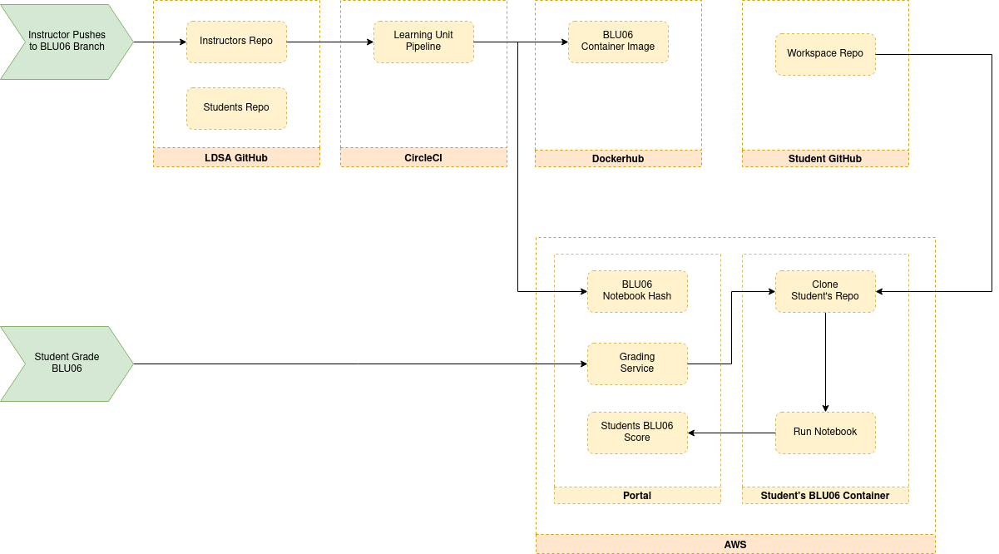

Project Setup
===============

Repositories & CI
------------------

The portal requires two repositories to be set up, the instructors repository 
and the students repository.
The CI pipeline on the instructors repository will:

* Validate exercises
* Post the exercise checksum to the portal
* Create a docker image for the exercise
* Remove exercise solutions and place it on the students repository

This requires the following environment variables to be setup in the CI:

* `DOCKER_PASS` - Set as global environment variable
* `DOCKER_USER` - Set as global environment variable
* `PORTAL_CHECKSUM_URL_TEMPLATE` - Set to `https://portal.lisbondatascience.org/grading/academy/checksums/{unit_id}/`
* `PORTAL_HACKATHON_URL_TEMPLATE` - Set to `https://portal.lisbondatascience.org/hackathons/api/setup/{unit_id}/`
* `PORTAL_TOKEN` - Set to `portal-api` token in portal backoffice
* `STUDENT_REPO` - Set to the student repo ssh URL

> Admissions requires it's own repositories setup.

This requires the following environment variables to be setup in the CI:

* `DOCKER_PASS` - Set as global environment variable
* `DOCKER_USER` - Set as global environment variable
* `PORTAL_CHECKSUM_URL_TEMPLATE` - Set to `https://portal.lisbondatascience.org/grading/admissions/checksums/{unit_id}/`
* `STUDENT_REPO` - Set to the student repo ssh URL

Portal Variables
------------------

Portal setup is done mostly through its kubernetes configmap.
The variables that change according to the batch are:

* `STUDENT_REPO_NAME`
* `DJANGO_AWS_STORAGE_BUCKET_NAME`
* `SLACK_WORKSPACE`

The `PORTAL_TOKEN` mentioned in the previous section is a Django authentication
token generated for the user setup in `GRADING_USERNAME`.
